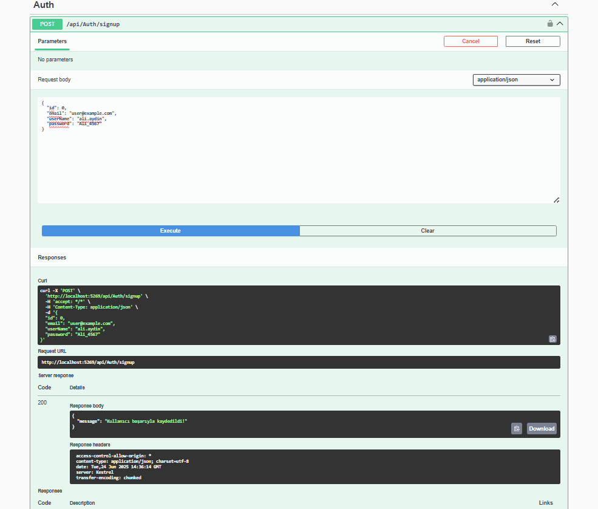
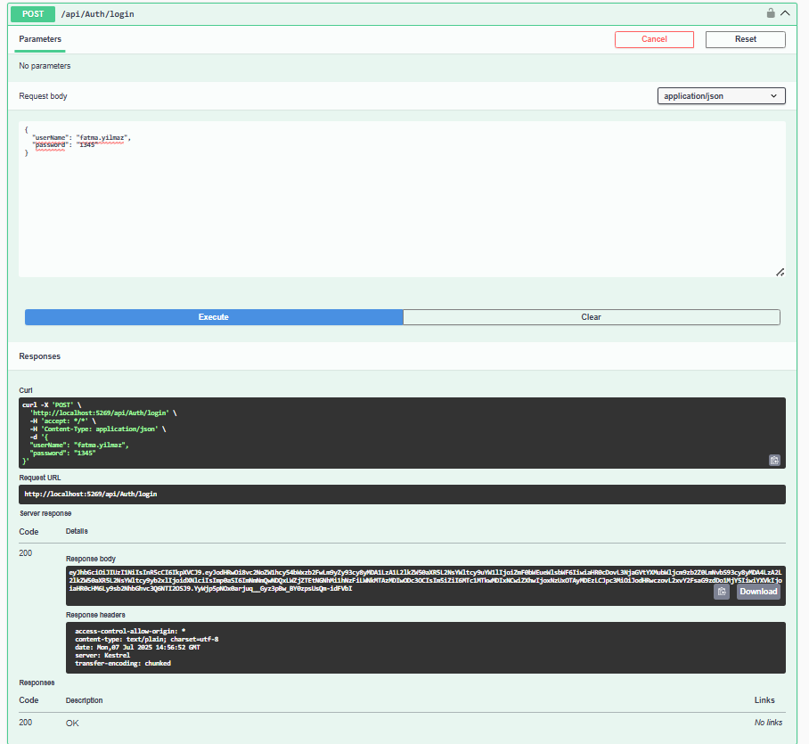
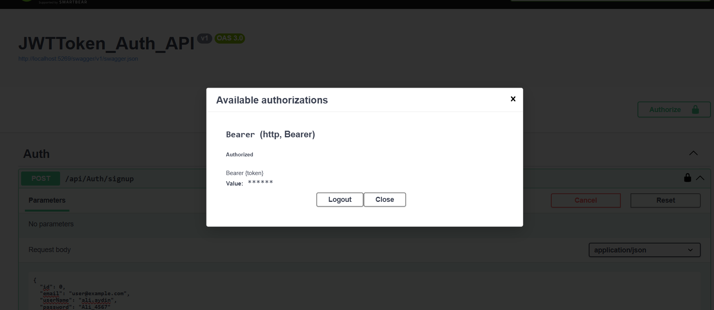
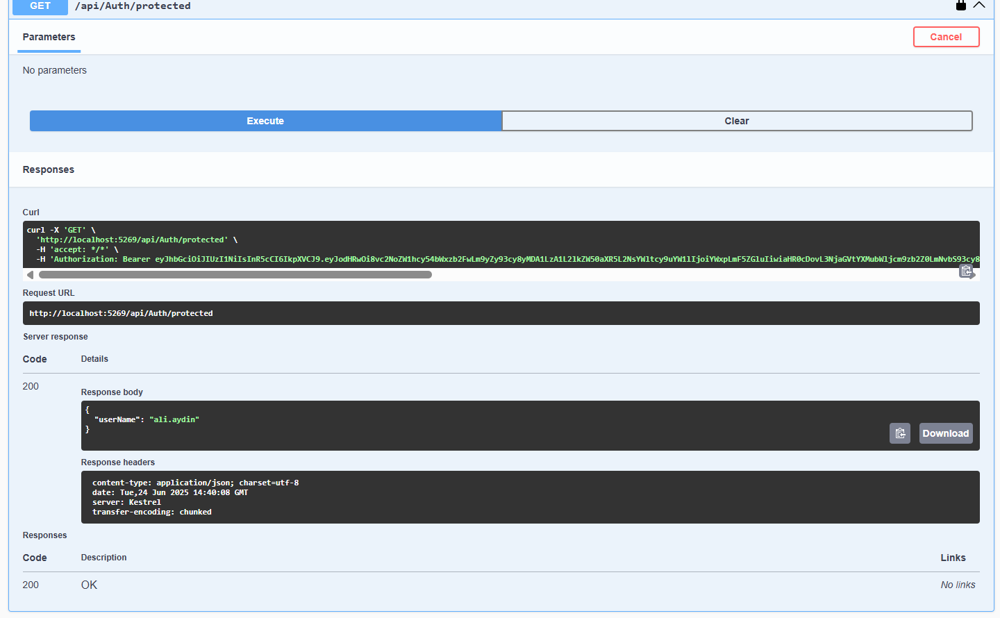
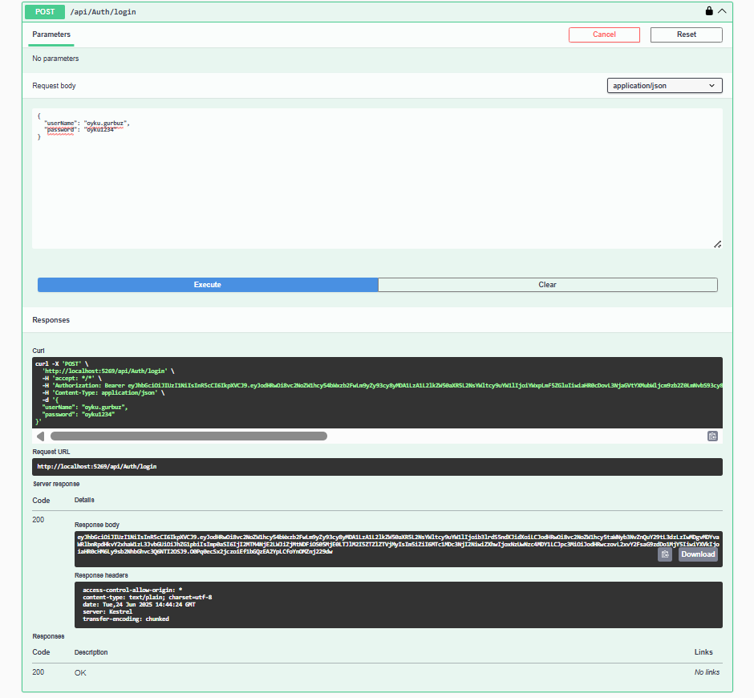
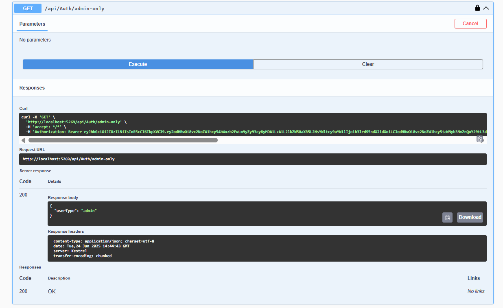

# JwtTokenProject

Bu proje, JWT (JSON Web Token) kullanarak kullanıcı kimlik doğrulama (authentication) ve yetkilendirme (authorization) sağlayan bir ASP.NET Core Web API uygulamasıdır.  

Swagger arayüzü ile test edilebilir ve başka UI projeleri (örneğin WebAppDemo_update) ile entegre çalışacak şekilde tasarlanmıştır.

## Özellikler

- Kullanıcı Kayıt (Signup) işlemi
- Kullanıcı Girişi (Login) ve JWT Token üretimi
- JWT ile yetkili endpoint koruması (Authorize)
- Rol bazlı yetkilendirme (`admin` örneği)
- Swagger ile API dökümantasyonu
- Token doğrulama & süresi ayarlama (ExpireMinutes)
- Token cookie'de veya header’da kullanılabilir

## Kullanılan Teknolojiler

- ASP.NET Core Web API (.NET 8)
- Entity Framework Core
- SQL Server (LocalDB)
- JWT Token (Microsoft.IdentityModel.Tokens & System.IdentityModel.Tokens.Jwt)
- Role tabanlı `[Authorize]` sistemi

## JWT Sistemi

- Kullanıcı giriş yaptığında `JwtTokenHandler` ile bir **JWT token** üretilir.
- Token içerisinde:
  - `UserName`
  - `Role` (admin/user)
  - `Jti` (benzersiz token ID) yer alır.
- `appsettings.json` içinde ayarlanan:
  - `Jwt:Key` → Gizli anahtar
  - `Jwt:Issuer`, `Jwt:Audience` → Token geçerlilik kaynakları
  - `Jwt:ExpireMinutes` → Süre tanımı (örn. 30 dk)

  ## Swagger ile API Dökümantasyonu

  Proje çalıştırıldığında Swagger arayüzü ile endpoint’ler test edilebilir.

  
- `POST /api/Auth/signup` → Yeni kullanıcı kaydı  
- `POST /api/Auth/login` → Giriş ve token alma  
- `GET /api/Auth/protected` → JWT ile korunan alan  
- `GET /api/Auth/admin-only` → Sadece `admin` rolüne açık

## Endpoint Özeti

| Endpoint               | Açıklama                          | HTTP Method | Yetki               |
| ---------------------- | --------------------------------- | ----------- | ------------------- |
| `/api/Auth/signup`     | Yeni kullanıcı oluşturur          | `POST`      | Herkes              |
| `/api/Auth/login`      | Kullanıcı girişi ve token üretimi | `POST`      | Herkes              |
| `/api/Auth/protected`  | JWT ile korunan alan              | `GET`       | Token gerekir       |
| `/api/Auth/admin-only` | Sadece admin erişebilir           | `GET`       | Token + Role\:admin |

## Yapılandırma (appsettings.json)
```csharp
 "Jwt": {
   "Key": "a_very_secure_256_bit_jwt_key_1234567890",
   "Issuer": "https://localhost:5269",
   "Audience": "https://localhost:5269",
   "ExpireMinutes": 30
 },
 ```
## İlgili Proje

Jwt_DevExpress_ProductCrud_WebApp (https://github.com/oykugurbuz/Jwt_DevExpress_ProductCrud_WebApp)

## Swagger ile API dökümantasyonu Görselleri

### Kullanıcı Kayıt (Signup) İşlemi



### Kullanıcı Girişi (Login) ve JWT Token Üretimi


### Authorize



### Role tabanlı `[Authorize]` sistemi

Admin yetkisine sahip olmayan kullanıcı erişmeye çalıştığında 403 hatası döner.
![Role tabanlı `[Authorize]` sistemi görseli](screenshots/admin_only_error.png)

Admin yetkisine sahip kullanıcı giriş yapar.


Erişim sağlanır.
